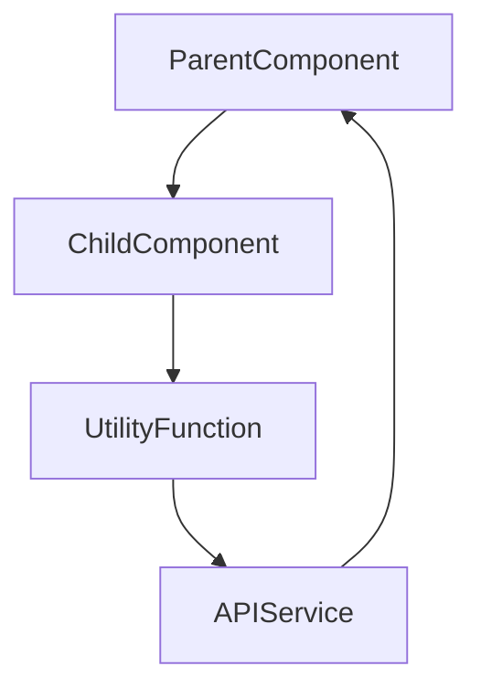

# Comprehensive Documentation Strategy

## Overview
This workflow ensures your codebase has comprehensive, maintainable documentation that covers core components, their functionality, interactions, use cases, and provides step-by-step tutorials. The strategy emphasizes building on existing documentation and keeping it continuously updated.

## Steps

### 1. Audit Existing Documentation
Start by analyzing what documentation already exists:
- Check for README files, docs folders, and inline comments
- Identify gaps in current documentation
- Review existing documentation for accuracy and completeness
- Create an inventory of documented vs. undocumented components

### 2. Create Documentation Structure
Establish a consistent documentation hierarchy:
```
docs/
├── README.md (project overview)
├── getting-started/
│   ├── installation.md
│   ├── quick-start.md
│   └── configuration.md
├── components/
│   ├── core-components.md
│   ├── ui-components.md
│   └── utility-functions.md
├── guides/
│   ├── user-guides.md
│   ├── developer-guides.md
│   └── deployment-guides.md
├── api/
│   ├── endpoints.md
│   └── data-schemas.md
└── tutorials/
    ├── basic-usage.md
    ├── advanced-features.md
    └── troubleshooting.md
```

### 3. Document Core Components
For each core component, create comprehensive documentation:

#### Component Template
```markdown
## ComponentName

### Description
Brief overview of what this component does and its purpose in the system.

### Props
| Prop | Type | Default | Description |
|------|------|---------|-------------|
| propName | string | 'default' | Description of the prop |

### State Management
- Internal state variables and their purposes
- How state flows through the component
- Any side effects or data fetching

### Dependencies
- External libraries used
- Internal components it depends on
- API endpoints or services it connects to

### Usage Examples
```jsx
<BasicExample />
<AdvancedExample />
```

### Best Practices
- Do's and don'ts for using this component
- Performance considerations
- Common pitfalls to avoid

### Testing
- How to test this component
- Test cases coverage
- Mock data requirements
```

### 4. Document Component Interactions
Map out how components work together:

#### Interaction Documentation
- **Data Flow**: How data moves between components
- **Event Handling**: Parent-child communication patterns
- **State Sharing**: Context usage, prop drilling, state management
- **Lifecycle**: Component mounting, updating, and unmounting sequences

#### Create Interaction Diagrams
Use Mermaid diagrams to visualize:


### 5. Create Use Cases and Examples
Document real-world scenarios:

#### Use Case Template
```markdown
## Use Case: [Scenario Name]

### Problem Description
What problem does this solve?

### Solution Approach
How the components work together to solve it

### Implementation Steps
1. Step one
2. Step two
3. Step three

### Code Example
```jsx
// Complete working example
```

### Expected Outcome
What the user should see or achieve
```

### 6. Develop Step-by-Step Tutorials
Create progressive learning paths:

#### Tutorial Structure
1. **Prerequisites**: What users need to know first
2. **Learning Objectives**: What they'll accomplish
3. **Step-by-Step Instructions**: Detailed, numbered steps
4. **Code Along**: Complete code examples for each step
5. **Verification**: How to check if it's working
6. **Next Steps**: What to learn next

#### Tutorial Types
- **Getting Started**: Basic setup and first use
- **Feature Deep Dives**: Exploring specific functionality
- **Integration Guides**: Connecting with other systems
- **Troubleshooting**: Common problems and solutions

### 7. Establish Documentation Standards
Create consistent guidelines:

#### Writing Standards
- Use clear, simple language
- Follow consistent formatting (headings, code blocks, tables)
- Include table of contents for long documents
- Use present tense for descriptions
- Include code examples with proper syntax highlighting

#### Code Documentation
- JSDoc comments for functions and classes
- Component prop documentation
- Inline comments for complex logic
- Type definitions for TypeScript projects

### 8. Implement Continuous Updates
Keep documentation current with code changes:

#### Update Triggers
- Before merging new features
- During code reviews
- When fixing bugs
- After architectural changes

#### Review Process
1. **Weekly Reviews**: Check for outdated information
2. **Release Updates**: Update documentation with each release
3. **Community Feedback**: Incorporate user suggestions
4. **Analytics**: Monitor which documentation is most used

### 9. Validate Documentation Quality
Ensure documentation is actually helpful:

#### Quality Checklist
- [ ] All public components are documented
- [ ] Examples are tested and working
- [ ] Installation instructions are accurate
- [ ] Troubleshooting covers common issues
- [ ] Links between documents work correctly
- [ ] Code examples follow current best practices
- [ ] Documentation is searchable and findable

#### User Testing
- Have new team members follow tutorials
- Collect feedback on clarity and completeness
- Track common support questions and document answers

### 10. Tools and Automation
Use tools to maintain documentation quality:

#### Documentation Tools
- **Static Site Generators**: Docusaurus, GitBook, MkDocs
- **API Documentation**: Swagger/OpenAPI, Postman
- **Code Documentation**: JSDoc, TypeDoc
- **Diagram Tools**: Mermaid, PlantUML

#### Automation Scripts
```bash
# Check for undocumented components
npm run docs:check

# Generate API documentation
npm run docs:api

# Validate code examples
npm run docs:test

# Deploy documentation
npm run docs:deploy
```

## Best Practices

### Content Strategy
- **Start with User Needs**: What do users need to accomplish?
- **Progressive Disclosure**: Start simple, add complexity gradually
- **Multiple Learning Paths**: Cater to different skill levels
- **Real Examples**: Use actual code from your project

### Maintenance Strategy
- **Documentation-First**: Write docs before or during development
- **Version Control**: Keep documentation in the same repo as code
- **Review Process**: Include documentation in code reviews
- **Automated Checks**: Validate links and code examples

### Accessibility
- **Screen Reader Friendly**: Use proper heading structure
- **Printable Styles**: Ensure docs print well
- **Mobile Responsive**: Documentation should work on all devices
- **Search Functionality**: Help users find what they need quickly

## Documentation Templates

### README Template
```markdown
# Project Name

## Quick Start
[3-5 steps to get running]

## Features
[Brief list of main features]

## Documentation
[Link to full documentation]

## Contributing
[How to contribute]

## License
[License information]
```

### Component Library Template
```markdown
# Component Library Documentation

## Design System
[Colors, typography, spacing guidelines]

## Components
[Alphabetical list with brief descriptions]

## Patterns
[Common usage patterns and best practices]

## Migration Guide
[How to update from previous versions]
```

## Implementation Commands

```bash
# Create documentation structure
mkdir -p docs/{getting-started,components,guides,api,tutorials}

# Generate component documentation
npx jsdoc src/ -d docs/api/

# Check for broken links
npx markdown-link-check docs/

# Serve documentation locally
npx docusaurus start
```

## Success Metrics

Track documentation effectiveness:
- Reduced support tickets
- Faster onboarding time
- Higher contribution rates
- Better user satisfaction scores
- Fewer duplicate questions in forums
