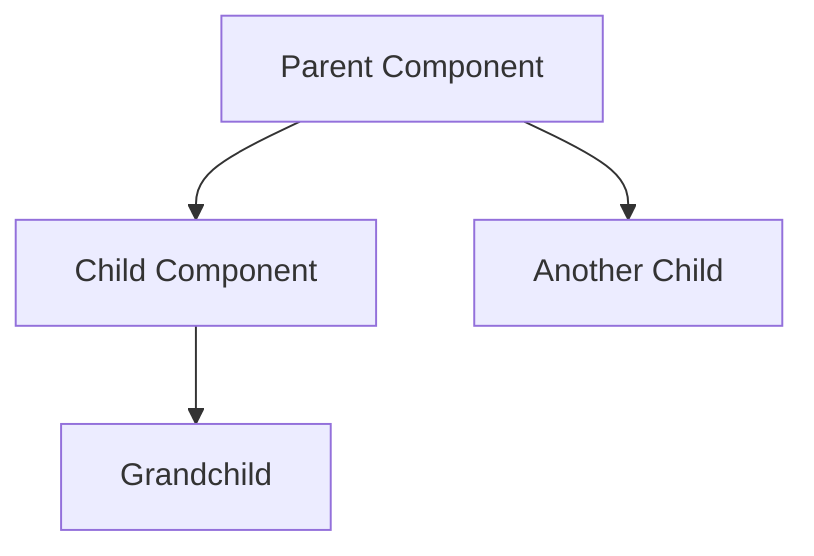
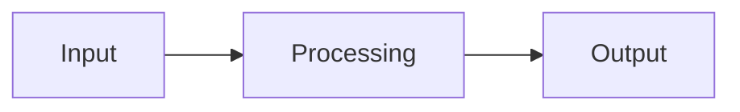
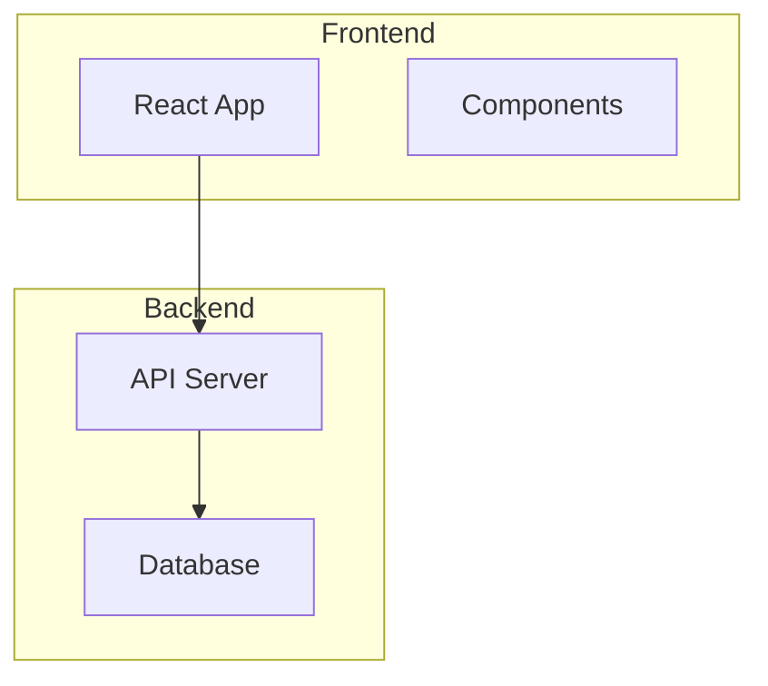
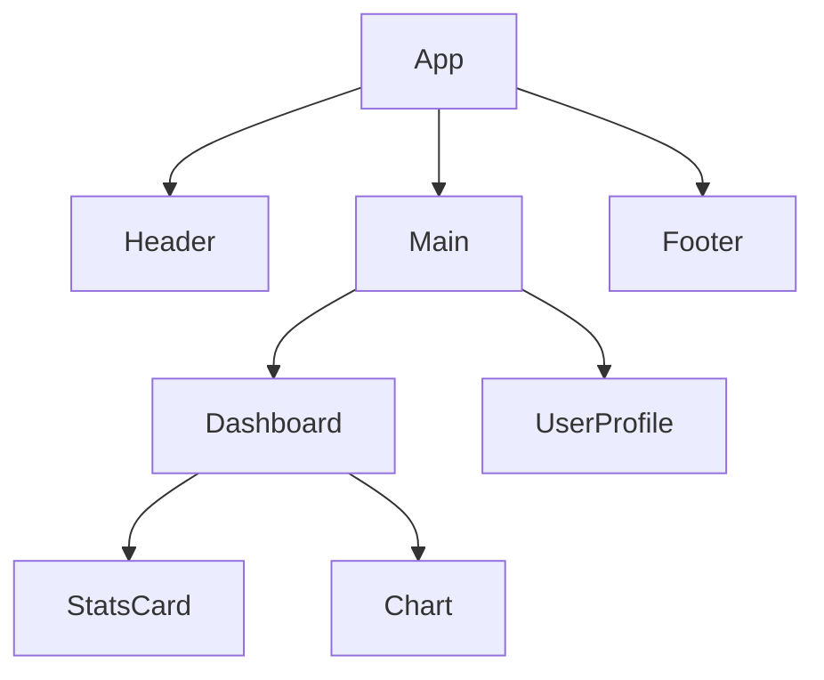
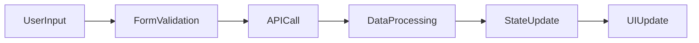
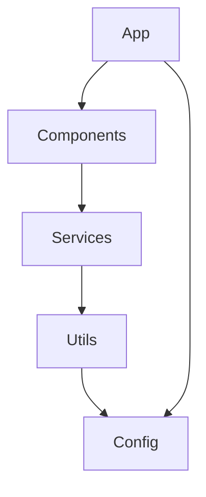

# Visual Component Mapping with Mermaid

## Overview
This workflow helps you create Mermaid diagrams to visualize relationships between core components in your codebase. This is useful for understanding system architecture, identifying dependencies, planning new features, and onboarding new team members.

## Steps

### 1. Analyze the Current Codebase Structure
Identify the main components and their relationships in your project:
- Look for React components, modules, services
- Identify data flow and dependencies
- Note key architectural patterns

### 2. Choose the Right Mermaid Diagram Type
Select the appropriate diagram based on what you want to visualize:

**For component hierarchy:**


**For data flow:**


**For system architecture:**


### 3. Create Component Inventory
List all major components with their:
- Purpose/functionality
- Dependencies (what they import/use)
- Children/parent relationships
- Data flow direction

### 4. Draft the Mermaid Diagram
Start with a rough sketch:
- Use nodes for components/services
- Use arrows to show relationships/data flow
- Group related components with subgraphs
- Add meaningful labels

### 5. Refine and Detail the Diagram
Enhance your diagram with:
- Clear, descriptive node names
- Proper arrow directions (TD, LR, TB, RL)
- Color coding for different component types
- Annotations for important relationships

### 6. Validate the Diagram
Review your diagram for:
- Completeness (all major components included)
- Accuracy (correct relationships shown)
- Clarity (easy to understand)
- Consistency (uniform styling and naming)

### 7. Document and Share
- Add the diagram to your documentation
- Include explanations of component roles
- Update as the system evolves
- Share with team members for onboarding

## Best Practices

### Diagram Design
- Keep diagrams focused on one aspect (don't try to show everything)
- Use consistent naming conventions
- Limit complexity - break large diagrams into smaller ones
- Use colors to differentiate component types

### Component Analysis
- Start with entry points (main files, routes)
- Follow import statements to find dependencies
- Identify state management patterns
- Look for API calls and data transformations

### Maintenance
- Update diagrams when architecture changes
- Version control your diagrams along with code
- Create different views for different audiences (technical vs. high-level)

## Example Commands for Analysis

```bash
# Find all React components
find . -name "*.jsx" -o -name "*.tsx" | head -20

# Analyze import dependencies
rg -n "import.*from" src/ --type js

# Find API endpoints
rg -n "api\|fetch\|axios" src/ --type js

# Identify main components
rg -n "export default|export.*Component" src/ --type js
```

## Common Mermaid Patterns

### React Component Tree


### Data Flow Architecture


### Module Dependencies


## Tools and Resources

### Mermaid Live Editor
Use [Mermaid Live Editor](https://mermaid.live) to test and refine diagrams

### VS Code Extensions
- Markdown Preview Mermaid Support
- Mermaid Markdown Syntax Highlighting

### Documentation Integration
- Add diagrams to README.md files
- Include in project documentation
- Use in Pull Request descriptions
