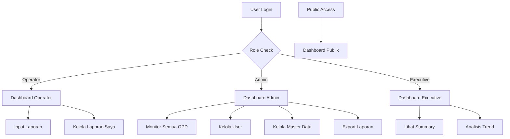

# User Experience Flow & User Journey Map
## Sistem Monitoring dan Pelaporan Retribusi Daerah

**Version:** 1.0  
**Date:** November 5, 2025  
**Scope:** Complete user flows for all personas

---

## 1. User Journey Overview

### 1.1 Primary User Personas Journey Summary

```
OPERATOR OPD → Input laporan harian → Monitor laporan mereka
     ↓
ADMIN BAPENDA → Monitor semua OPD → Kelola user dan data → Export laporan
     ↓  
EKSEKUTIF → Lihat dashboard summary → Analisis trend → Decision making
     ↓
PUBLIK → Akses transparansi → Lihat data agregat → Kepercayaan publik
```

### 1.2 System Interaction Flow



---

## 2. Detailed User Flows

### 2.1 Operator OPD User Flow

#### Flow 1: Daily Login & Input Laporan

**Journey Steps:**
1. **Entry Point:** Operator masuk kantor, buka browser
2. **Authentication:** Login dengan username/password
3. **Dashboard Overview:** Lihat summary laporan hari ini
4. **Input Process:** Input laporan retribusi harian
5. **Verification:** Review dan confirm data
6. **Completion:** Success feedback dan redirect

**Detailed Flow:**

```
START → Login Page
  ↓
Enter username/password → Validate credentials
  ↓ (Success)
Dashboard Operator (Landing Page)
  │
  ├─ Summary Cards (Today's reports, This week, This month)
  ├─ Quick Actions (Input Laporan Baru, Lihat Semua Laporan)
  ├─ Recent Reports Table (Last 5 entries)
  └─ Chart (Weekly trend)
  ↓
Click "Input Laporan Baru"
  ↓
Form Input Laporan
  ├─ Select Jenis Retribusi (dropdown, filtered by user assignment)
  ├─ Date Picker Tanggal Setor (default: today, allow backdate)
  ├─ Number Input Nominal (currency format)
  ├─ File Upload Bukti Setor (PDF/JPG/PNG, max 5MB)
  └─ Textarea Keterangan (optional)
  ↓
Real-time Validation
  ├─ Check required fields
  ├─ Validate file type/size
  ├─ Check duplicate (same retribusi + date)
  └─ Format currency properly
  ↓
Click "Simpan Laporan"
  ↓
Loading State (Upload file + save data)
  ↓
Success Page/Modal
  ├─ "Laporan berhasil disimpan"
  ├─ Summary of saved data
  ├─ "Input Laporan Lagi" button
  └─ "Lihat Semua Laporan" button
END
```

**Pain Points & Solutions:**
- **Pain:** Lupa tanggal setor yang tepat
- **Solution:** Date picker dengan calendar visual, highlight weekend/holiday
- **Pain:** Upload file gagal (size/format)
- **Solution:** Real-time validation dengan progress bar dan clear error messages
- **Pain:** Duplicate entry tidak sengaja
- **Solution:** Auto-check duplicate dengan warning message

**Success Metrics:**
- Time to complete: < 2 minutes per report
- Error rate: < 5% on form submission
- User satisfaction: > 80% (easy to use rating)

#### Flow 2: Manage Existing Reports

```
Dashboard Operator → Click "Lihat Semua Laporan"
  ↓
List Laporan Page
  ├─ Filter Controls (Date range, Jenis retribusi, Status)
  ├─ Sort Options (Tanggal setor, Nominal, Created date)
  ├─ Pagination (20 items per page)
  └─ Data Table
      ├─ Columns: Tanggal Setor, Jenis Retribusi, Nominal, Status, Actions
      └─ Actions: View Detail, Edit (if active), Delete (if active)
  ↓
Select Action:
  │
  ├─ View Detail → Modal/Drawer
  │   ├─ All report information
  │   ├─ View bukti setor file
  │   ├─ Audit trail (created, modified)
  │   └─ Close button
  │
  ├─ Edit Report → Edit Form
  │   ├─ Pre-filled form with existing data
  │   ├─ Same validation as input form
  │   ├─ Save changes → Update confirmation
  │   └─ Cancel → Return to list
  │
  └─ Delete Report → Confirmation Dialog
      ├─ "Apakah Anda yakin ingin menghapus laporan ini?"
      ├─ Show report summary
      ├─ Require reason (textarea)
      ├─ Cancel / Confirm buttons
      └─ Success message → Refresh list
END
```

### 2.2 Admin Bapenda User Flow

#### Flow 1: Daily Monitoring & Management

```
START → Admin Login → Admin Dashboard
  ↓
Dashboard Overview
  ├─ Summary Cards (All OPD today, week, month, year totals)
  ├─ Alert Indicators (OPD yang belum lapor hari ini)
  ├─ Real-time Charts
  │   ├─ Trend 30 hari terakhir
  │   ├─ Komparasi per OPD bulan ini
  │   ├─ Breakdown per kategori retribusi
  │   └─ Top retribusi types
  └─ Latest Reports Table (50 entries, all OPD)
  ↓
Monitor Activities:
  │
  ├─ Check Alert → Click "X OPD belum lapor hari ini"
  │   ├─ Modal/Page dengan list OPD
  │   ├─ Contact information per OPD
  │   ├─ Send reminder action (email)
  │   └─ Close monitoring
  │
  ├─ Review Reports → Click on table entries
  │   ├─ View report details
  │   ├─ Validate data quality
  │   ├─ Cancel if needed (with reason)
  │   └─ Continue monitoring
  │
  └─ Generate Reports → Export functionality
      ├─ Select filters (date range, OPD, type)
      ├─ Choose format (Excel/PDF)
      ├─ Background processing
      ├─ Download notification
      └─ File download
END
```

#### Flow 2: User & Master Data Management

```
Admin Dashboard → Navigation Menu → Management Section
  ↓
Choose Management Type:
  │
  ├─ User Management
  │   ├─ List Users (filter: OPD, role, status)
  │   ├─ Add New User
  │   │   ├─ Form: username, email, role, OPD assignment
  │   │   ├─ Auto-generate password option
  │   │   ├─ Send credentials via email
  │   │   └─ Success confirmation
  │   ├─ Edit User
  │   │   ├─ Update details (keep password unless changed)
  │   │   ├─ Change OPD assignment
  │   │   ├─ Activate/Deactivate status
  │   │   └─ Save changes with audit log
  │   └─ Assign Retribusi to User
  │       ├─ Select user
  │       ├─ Multi-select retribusi types
  │       ├─ Save assignment
  │       └─ Update user permissions
  │
  ├─ OPD Management
  │   ├─ List OPD (all regional agencies)
  │   ├─ Add New OPD
  │   │   ├─ Form: name, code, description
  │   │   ├─ Code uniqueness validation
  │   │   └─ Save with confirmation
  │   ├─ Edit OPD
  │   │   ├─ Update details
  │   │   ├─ Check for dependencies (users, retribusi)
  │   │   └─ Save changes
  │   └─ Cannot Delete (if has users or retribusi)
  │
  └─ Jenis Retribusi Management
      ├─ List Retribusi (filter: kategori, OPD)
      ├─ Add New Retribusi Type
      │   ├─ Form: kategori, nama, kode, assign to OPD
      │   ├─ Code uniqueness validation
      │   ├─ OPD selection
      │   └─ Save with confirmation
      ├─ Edit Retribusi Type
      │   ├─ Update details
      │   ├─ Cannot change OPD if has reports
      │   └─ Save changes with audit
      └─ Cannot Delete (if has reports)
END
```

### 2.3 Executive User Flow

#### Flow: Executive Dashboard Analysis

```
START → Executive Login → Executive Dashboard
  ↓
High-Level Overview (Simplified Interface)
  ├─ Large Summary Cards
  │   ├─ Total Retribusi Bulan Ini vs Target (% achievement)
  │   ├─ Total Retribusi YTD vs Target
  │   ├─ Growth Rate (vs previous period)
  │   └─ Performance Status (Green/Yellow/Red indicator)
  ├─ Key Visual Charts (Large, Clear)
  │   ├─ 12-month Trend with Target Line
  │   ├─ Top 5 OPD Performance (Bar Chart)
  │   └─ Revenue Category Breakdown (Pie Chart)
  └─ Filter Options (Preset: Bulan Ini, Triwulan Ini, Tahun Ini)
  ↓
Executive Actions:
  │
  ├─ Drill Down Analysis
  │   ├─ Click on chart elements
  │   ├─ See detailed breakdown
  │   ├─ Identify trends and patterns
  │   └─ Return to overview
  │
  ├─ Print/Export for Meeting
  │   ├─ Executive Summary Report (PDF)
  │   ├─ Key metrics and trends
  │   ├─ Formatted for presentation
  │   └─ Download for offline use
  │
  └─ Performance Review
      ├─ Compare OPD performance
      ├─ Identify top/bottom performers
      ├─ Note areas needing attention
      └─ Decision making support
END
```

### 2.4 Public User Flow

#### Flow: Transparency Dashboard Access

```
START → Public Access (No Login Required)
  ↓
Public Dashboard Landing Page
  ├─ Header: "Transparansi Pendapatan Retribusi Daerah"
  ├─ Current Period Summary
  │   ├─ Total Retribusi Bulan Ini
  │   ├─ Total Retribusi Tahun Ini
  │   └─ Last Updated timestamp
  ├─ Educational Content
  │   ├─ "Apa itu Retribusi Daerah?"
  │   ├─ Jenis-jenis Retribusi
  │   └─ Manfaat untuk Masyarakat
  └─ Visual Data (Aggregate Only)
      ├─ 12-month Historical Trend
      ├─ Breakdown by Category (no OPD detail)
      └─ No personal/sensitive information
  ↓
Public Actions:
  │
  ├─ Explore Data
  │   ├─ Interactive charts (limited drill-down)
  │   ├─ Historical comparison
  │   └─ Read-only access
  │
  ├─ Learn About Retribusi
  │   ├─ Educational materials
  │   ├─ FAQ section
  │   └─ Contact information
  │
  └─ Share Information
      ├─ Social media sharing
      ├─ Print-friendly version
      └─ Basic data only (no exports)
END
```

---

## 3. Cross-Flow Interactions

### 3.1 Error Handling Flows

#### Network Error Flow
```
User Action → API Call → Network Error
  ↓
Error Detection
  ├─ Show error message: "Koneksi terputus, coba lagi"
  ├─ Retain form data (don't clear)
  ├─ Retry mechanism (automatic + manual)
  └─ Offline indicator if applicable
  ↓
Recovery Options
  ├─ Auto-retry (3 attempts)
  ├─ Manual retry button
  ├─ Save draft locally (if possible)
  └─ Contact support information
```

#### Validation Error Flow
```
Form Submission → Validation Error
  ↓
Client-Side Validation
  ├─ Real-time field validation
  ├─ Clear error messages in Bahasa Indonesia
  ├─ Highlight problematic fields
  └─ Prevent submission until fixed
  ↓
Server-Side Validation (if client validation passes)
  ├─ Display server validation errors
  ├─ Map errors to specific fields
  ├─ Preserve user input
  └─ Focus on first error field
```

### 3.2 Notification Flows

#### Success Feedback Flow
```
Successful Action → Success Indication
  ├─ Toast notification (3 seconds)
  ├─ Success icon and message
  ├─ Next action suggestions
  └─ Automatic progression or user choice
```

#### Alert/Warning Flow  
```
System Detection → Alert Condition
  ├─ Priority-based notification
  ├─ Clear action required message
  ├─ Multiple notification channels (in-app, email)
  └─ Dismissal or action required
```

---

## 4. Mobile User Experience

### 4.1 Mobile-Specific Flows

#### Mobile Operator Flow
```
Mobile Login → Touch-Optimized Dashboard
  ├─ Simplified navigation (bottom tab bar)
  ├─ Card-based layout (thumb-friendly)
  ├─ Gesture support (swipe, tap)
  └─ Voice input for keterangan field
  ↓
Mobile Input Form
  ├─ Full-screen form experience
  ├─ Step-by-step wizard (multi-step if needed)
  ├─ Camera integration for bukti setor
  ├─ Auto-complete and suggestions
  └─ Large touch targets (min 44px)
  ↓
Mobile Review
  ├─ Summary before submit
  ├─ Easy editing access
  ├─ Thumb-friendly confirm button
  └─ Clear success feedback
```

### 4.2 Responsive Considerations

**Breakpoint Behaviors:**
- **Mobile (< 768px):** Single column, bottom navigation, simplified forms
- **Tablet (768px - 1024px):** Two-column layout, condensed sidebar
- **Desktop (> 1024px):** Full feature set, multi-column layouts

---

## 5. Accessibility Journey

### 5.1 Screen Reader Flow
```
Page Load → Screen Reader Announces
  ├─ Page title and main purpose
  ├─ Navigation landmarks
  ├─ Main content structure
  └─ Interactive elements with labels
  ↓
Form Navigation
  ├─ Label associations clear
  ├─ Error messages linked to fields
  ├─ Required field indicators
  └─ Progress/completion feedback
```

### 5.2 Keyboard Navigation Flow
```
Tab Key Navigation → Logical Focus Order
  ├─ Skip links available
  ├─ Focus indicators visible
  ├─ Trapped focus in modals
  └─ Escape key functionality
  ↓
Form Interaction
  ├─ Arrow keys for radio/select
  ├─ Enter/Space for buttons
  ├─ Tab for field progression
  └─ Shift+Tab for backward navigation
```

---

## 6. Performance Journey

### 6.1 Loading Experience
```
Initial Page Load
  ├─ Skeleton screens for layout
  ├─ Progressive loading of content
  ├─ Critical CSS inline
  └─ Non-critical resources deferred
  ↓
Data Loading
  ├─ Loading indicators
  ├─ Incremental updates
  ├─ Cached data when possible
  └─ Graceful degradation
```

### 6.2 Offline Experience
```
Network Unavailable
  ├─ Offline indicator
  ├─ Cached data display
  ├─ Queue actions for sync
  └─ Clear offline limitations
  ↓
Network Restored
  ├─ Auto-sync queued actions
  ├─ Conflict resolution if needed
  ├─ Success confirmation
  └─ Resume normal operation
```

---

## 7. Security Journey

### 7.1 Authentication Flow
```
Login Attempt → Security Validation
  ├─ HTTPS enforcement
  ├─ Rate limiting protection
  ├─ Session token generation
  └─ Secure cookie handling
  ↓
Authenticated Session
  ├─ Token refresh handling
  ├─ Inactivity timeout
  ├─ Secure logout process
  └─ Session hijacking protection
```

### 7.2 Data Protection Flow
```
Sensitive Data Access → Protection Measures
  ├─ Role-based access control
  ├─ Audit trail logging
  ├─ Data encryption in transit
  └─ Minimal data exposure
```

---

## 8. Journey Success Metrics

### 8.1 Task Completion Metrics

**Operator OPD:**
- Input laporan success rate: > 95%
- Average time per laporan: < 2 minutes
- Error correction rate: < 10% require editing

**Admin Bapenda:**
- Daily monitoring completion: < 15 minutes
- Export generation time: < 30 seconds for 1000 records
- User management task completion: > 90%

**Executive:**
- Dashboard insight extraction: < 5 minutes
- Decision-support information access: < 3 clicks

**Public:**
- Transparency information access: < 30 seconds
- Educational content engagement: > 60% read completion

### 8.2 User Satisfaction Metrics

**Usability Metrics:**
- System Usability Scale (SUS): Target > 70
- Task success rate: > 90%
- User error rate: < 5%
- User satisfaction rating: > 4.0/5.0

**Performance Metrics:**
- Page load time: < 2 seconds
- Form submission time: < 1 second
- Dashboard refresh time: < 3 seconds
- Mobile responsiveness score: > 90

---

This comprehensive user journey map ensures all user interactions are well-designed, accessible, and efficient for the Indonesian regional retribution monitoring system. Each flow is optimized for the specific needs and technical literacy levels of government users while maintaining security and performance standards.